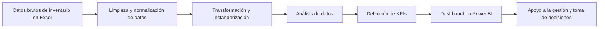

# Inventory Data Dashboard

Proyecto de análisis de datos y visualización orientado al proceso de inventario de activos fijos, desde la limpieza de datos brutos hasta la construcción de un dashboard gerencial para apoyar la toma de decisiones.

## Contenido

- [Objetivo](#objetivo)
- [Contexto](#contexto)
- [Flujo del proyecto](#flujo-del-proyecto)
- [Vista previa del proyecto](#Resultados)
- [Documentación adicional](#Documentación-del-proyecto)

## Objetivo
Transformar una base de datos de inventario en información útil para control, análisis y visualización ejecutiva.

## Contexto
Este proyecto presenta un caso aplicado de análisis y visualización de datos desarrollado a partir del inventario de activos fijos de una institución con múltiples sedes. La información original se encontraba desordenada, desactualizada y sin una estructura clara de clasificación por sede y área, lo que dificultaba el control y análisis del inventario. A partir de este escenario, se realizó un proceso de limpieza, estructuración y construcción de indicadores para desarrollar un dashboard gerencial orientado a la toma de decisiones.

## Problema
La información original presentaba desafíos de estructura, consistencia y legibilidad, lo que dificultaba el análisis y la generación de reportes útiles para la toma de decisiones.

## Solución desarrollada
Se realizó un proceso completo de:
- limpieza y transformación de datos
- estandarización de campos
- análisis exploratorio
- definición de indicadores clave
- construcción de dashboard gerencial

## Herramientas utilizadas
- Excel
- Power BI
- Power Query
- Python
- Power Platform

## Aprendizajes
Este proyecto permitió fortalecer habilidades en limpieza de datos, estructuración de información, definición de KPIs y desarrollo de dashboards orientados a gestión.

## Proceso de trabajo
1. Revisión de la base de datos original
2. Limpieza y normalización de campos
3. Identificación de inconsistencias y valores faltantes
4. Análisis de datos
5. Definición de KPIs
6. Diseño y desarrollo del dashboard
   
## Flujo del proyecto

## Indicadores generados
- total de activos registrados
- distribución por categoría
- activos por ubicación
- estado de los activos
- hallazgos relevantes para control y gestión

## Resultados
- Identificación del inventario real por sede
- Determinación del faltante total de activos
- Visualización de KPIs de inventario y valorización
- Segmentación por sede, área y año de ingreso
- Apoyo al área financiera para estimar el valor de inventario por sede

## Valor aportado
- mejora en la visibilidad del inventario
- apoyo a la gestión y control de activos
- reducción del tiempo de análisis manual
- información más clara para áreas de gestión

## Enfoque del proyecto
Por confidencialidad, este repositorio presenta una versión adaptada del caso real, sin exponer datos sensibles ni información interna.

## Capturas del dashboard

  
  

## Próximas mejoras
- automatización de actualización de datos
- integración con nuevas fuentes
- incorporación de alertas o indicadores avanzados

## Documentación del proyecto

Este repositorio incluye documentación complementaria sobre el contexto, la preparación de datos y los principales indicadores del dashboard.

- [Contexto de negocio](docs/business-context.md)
- [Proceso de limpieza y preparación de datos](docs/data-cleaning-process.md)
- [Insights e indicadores clave](docs/insights-and-kpis.md)

## Contacto

Si quieres conocer más sobre este proyecto o mi trabajo en automatización y análisis de datos, puedes escribirme a:  
[claudio.duran.m@gmail.com](mailto:claudio.duran.m@gmail.com)
